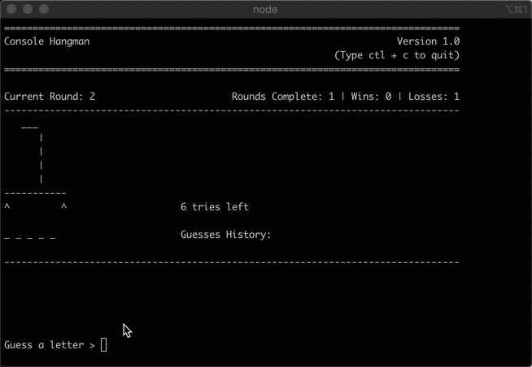
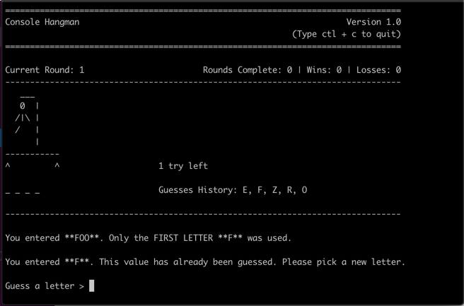
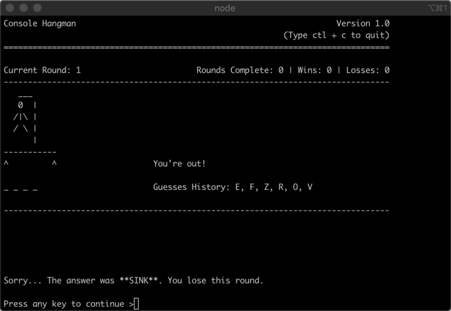

# hangman

Hangman Assignment for Javascript Fundamentals Fall 2019.

It is a fun Javascript implementation of the classic game.

## Demo

## Installation

1. Clone this repository `git clone https://github.com/zachwaite/hangman.git`
2. Navigate to the `hangman` directory
3. Use npm to install dependencies `npm install`

## Playing the Game

1. Navigate to the `hangman` directory
2. Run the game using `node .`
3. To exit, type `ctl + c` any time during game play

## Configuration (optional)

Hangman should work ok with default settings, but a few configuration
options are exposed to make the game easier or harder. Configuration can
be changed by editing the `config` variable in the `index.js` file. The
configuration options are:

- `maxGames` (default = Infinity): Set this to a positive integer value to
  keep from playing this game forever.
- `wordBank` (default = local file word-bank.json): Change this to another
  file or perhaps some special hangman web API. Just make sure the value is
  an Array.
- `templates` (default = ui.TEMPLATES6): Out of the box, 2 options are available. `ui.TEMPLATES6` makes the hangman stick figure a bit smaller
  and gives you 6 guesses to win. `ui.TEMPLATES8` makes a bigger stick
  figure and 8 guesses. The game can be extended by providing new templates
  using the same pattern (see `src/uiWidgets.js` for the template pattern).
  e.g. one could make a new template set `ui.TEMPLATES10` by putting shoes
  on the stick figure from `ui.TEMPLATES8`. The game will dynamically adapt
  as long as the template structure follows the same pattern. This is
  because the game bases the number of guesses on the length of the templates
  array. ASCII art afficionados may be able to make very long exciting games
  of hangman with minimal changes.

## Technical Overview

The game is modular and somewhat object oriented in it's implementation.
Specifically, a `GameSession` module is configured using the global
configuration options and the `GameSession.main()` method begins the
application loop, where child widgets are created, updated and destroyed,
application state variables are updated and play continues until the main
loop is exited. A small pattern is used throughout the game to standardize
the implementation of the components used to build the UI. Specifically,
each UI component (I call these `widgets`), implements a `.render()` method,
where the serialization to the console takes place. The data to
be rendered may be passed to `render()` explicitly via parameters or
implicitly via private variable access. The widgets use closures and the
_Revealing Module Pattern_ to provide persistent state during the game.
This was by design, to avoid excessive duplication and passing state variables
as parameters each round. It also fits well with the stateful nature of the game.

### The widgets

Screenshot 1 shows these widgets (top down)

- GameHeader (title, version)
- GameSummary (summary stats)
- Game (hangman avatar, tries remaining, guesses state & history)
- GameFooter (any messages to user)

Screenshot 2 shows these widgets (below the footer). These are seen when
transitioning between game rounds.

- GameResult (outcome messages)
- PlayAgain (prompt to break before clearing console)

Enjoy!
